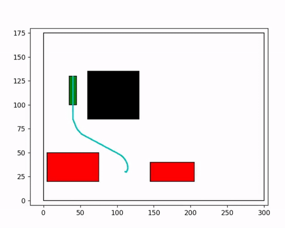
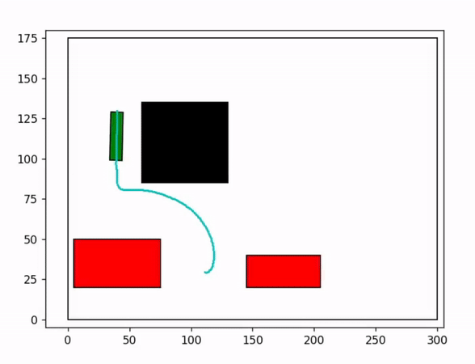
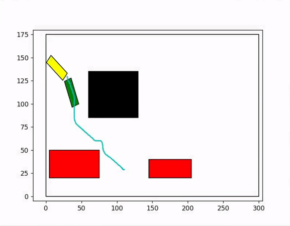

# A* kinematic path planner under non holonomic constraints
Create an A* kinematic path planner under non holonomic constraints for three vehicle types: 1. Delivery Robot (differential drive) 2. Car (Ackerman steering) 3. Truck (A car with single trailer attached)
The goal of the project is to start the vehicle at the northwest corner of the 2d map and find a path to the parking spot in between two vehicles while avoiding the obstacle at the center. The path should take into account the non holonomic constraints of the vehicle.(Implemented as part of project for RBE550 - Motion Planning course)

## Steps to run the code
- Install Numpy and Matplotlib libraries before running the code.
- To run the simulation in the code folder run:
  ```
  python main.py
  ```
- There are three vehicles in the simulation by default the code runs the simulation for the truck, uncomment necessary lines specified in `main.py` to run the simulation for other vehicles.

## Report
For detailed description of the implementation see the report [here](Report.pdf).

## Plots and Animations
Simulation for each vehicle:

### Delivery Robot

<p float="middle">

</p>

### Car

<p float="middle">

</p>

### Truck

<p float="middle">

</p>

Remaining plots are present in the report.

## References
1. Choset, Howie, et al. Principles of robot motion: theory, algorithms, and implementations. MIT press, 2005.
2. Steven M. LaValle. Planning Algorithms. Cambridge University Press, May 2006. ISBN
9780521862059. URL http://lavalle.pl/planning/.
